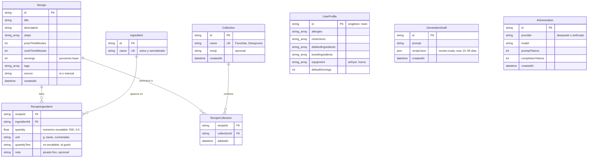

# RecepIA — Plan de implementación Fase 1 (MVP)

## Contexto

RecepIA es una app personal de recetas con IA. El usuario hoy genera recetas con ChatGPT pero no puede volver a encontrarlas ni filtrarlas. El MVP resuelve exactamente eso: **generar recetas conversando con la IA → guardarlas en listas → volverlas a encontrar filtrando por ingredientes → cocinarlas con el celular al lado**.

- Uso personal (un solo usuario). **No implementar autenticación ni login.**
- Los API keys son del dueño de la app y viven en variables de entorno. **No implementar BYOK.**
- El proyecto ya está scaffoldeado en Next.js con Prisma. Ajustar lo existente según este plan.

## Stack

- Next.js 14+ (App Router) + TypeScript + Tailwind CSS
- PostgreSQL hosteado en **Supabase**, vía **Prisma** como ORM
- **DeepSeek API** para generación de recetas (texto, conversacional)
- **Anthropic API** para visión (Fase 2 — en Fase 1 solo dejar el módulo preparado, sin UI)
- Diseño **mobile-first** con navegación inferior (bottom nav) + configuración **PWA**

## Variables de entorno (.env)

```
# Supabase: conexión con pooling (puerto 6543) — la usa la app
DATABASE_URL="postgresql://...@....pooler.supabase.com:6543/postgres?pgbouncer=true"
# Supabase: conexión directa (puerto 5432) — la usan las migraciones
DIRECT_URL="postgresql://...@....supabase.com:5432/postgres"
DEEPSEEK_API_KEY=sk-...
ANTHROPIC_API_KEY=sk-ant-...
```

Nunca exponer los keys al cliente. Todas las llamadas a IA pasan por API routes del servidor.

## Modelo de datos (reemplazar schema.prisma)

Eliminar los modelos `User`, `SavedRecipe` y `MealPlan` del scaffold.

```prisma
datasource db {
  provider  = "postgresql"
  url       = env("DATABASE_URL")
  directUrl = env("DIRECT_URL")
}

model Recipe {
  id              String             @id @default(cuid())
  title           String
  description     String?
  steps           String[]           // pasos numerados, uno por elemento
  prepTimeMinutes Int?
  cookTimeMinutes Int?
  servings        Int?               // porciones base de la receta
  tags            String[]           @default([])
  source          String             @default("ai") // "ai" | "manual"
  createdAt       DateTime           @default(now())
  updatedAt       DateTime           @updatedAt
  ingredients     RecipeIngredient[]
  collections     RecipeCollection[]
}

model Ingredient {
  id      String             @id @default(cuid())
  name    String             @unique // normalizado: minúsculas, singular ("tomate", no "Tomates")
  recipes RecipeIngredient[]
}

model RecipeIngredient {
  recipeId     String
  ingredientId String
  // IMPORTANTE para el escalado de porciones:
  quantity     Float?  // numérico cuando aplica: 500, 0.5, 2 — se escala al cambiar porciones
  unit         String? // "g", "tazas", "cucharadas", "unidades"
  quantityText String? // texto cuando NO es escalable: "al gusto", "una pizca" — no se escala
  note         String? // "picado fino", "opcional"
  recipe       Recipe     @relation(fields: [recipeId], references: [id], onDelete: Cascade)
  ingredient   Ingredient @relation(fields: [ingredientId], references: [id])

  @@id([recipeId, ingredientId])
  @@index([ingredientId])
}

model Collection {
  id        String             @id @default(cuid())
  name      String             @unique
  emoji     String?            // "🍳", "🎉"
  createdAt DateTime           @default(now())
  recipes   RecipeCollection[]
}

model RecipeCollection {
  recipeId     String
  collectionId String
  addedAt      DateTime   @default(now())
  recipe       Recipe     @relation(fields: [recipeId], references: [id], onDelete: Cascade)
  collection   Collection @relation(fields: [collectionId], references: [id], onDelete: Cascade)

  @@id([recipeId, collectionId])
  @@index([collectionId])
}

// Perfil de gustos: singleton (una sola fila), se inyecta en cada prompt de generación
model UserProfile {
  id                  String   @id @default("main")
  allergies           String[] @default([]) // "maní", "mariscos"
  restrictions        String[] @default([]) // "sin gluten", "baja en azúcar"
  dislikedIngredients String[] @default([]) // "cilantro"
  lovedIngredients    String[] @default([]) // "ajo", "limón"
  equipment           String[] @default([]) // "airfryer", "horno", "olla a presión"
  defaultServings     Int      @default(2)
  updatedAt           DateTime @updatedAt
}

// Borradores: generaciones no guardadas, recuperables desde "Recientes"
model GenerationDraft {
  id         String   @id @default(cuid())
  prompt     String   // el pedido del usuario (el último de la conversación)
  recipeJson Json     // el GeneratedRecipe completo tal cual lo devolvió la IA
  createdAt  DateTime @default(now())
}

model AiGeneration {
  id               String   @id @default(cuid())
  provider         String   // "deepseek" | "anthropic"
  model            String
  promptTokens     Int?
  completionTokens Int?
  createdAt        DateTime @default(now())
}
```

**Normalización de ingredientes:** al guardar una receta, cada ingrediente se normaliza (trim, minúsculas, singular cuando sea obvio) y se hace `upsert` en `Ingredient`.

**Limpieza perezosa de borradores:** antes de insertar un nuevo `GenerationDraft`, eliminar (a) los que excedan los 10 más recientes y (b) los de más de 90 días. Sin cron jobs.

**Seed:** crear la colección "⭐ Favoritas", el `UserProfile` con id "main" y valores vacíos, y 2-3 recetas de prueba.

## Capa de IA (`src/lib/ai/`)

Reemplazar `src/lib/deepseek.ts` por una carpeta con dos módulos:

### `src/lib/ai/recipe-generator.ts`

- Cliente de DeepSeek (`deepseek-chat`, endpoint compatible con OpenAI: `https://api.deepseek.com/v1/chat/completions`).
- **Es conversacional:** recibe un array `messages` (historial completo). La primera generación manda solo el pedido; los ajustes ("ahora sin horno", "más picante") agregan la receta anterior y la corrección al historial, y la IA devuelve la receta completa corregida en el mismo formato JSON.
- **El perfil del usuario se inyecta en el system prompt en cada llamada** (leer `UserProfile` de la DB).
- **Exigir respuesta en JSON estructurado.** Usar `response_format: { type: "json_object" }` y validar con Zod. Si el JSON no valida, reintentar 1 vez.
- Registrar cada llamada en `AiGeneration` y guardar cada resultado como `GenerationDraft` (con limpieza perezosa).

**System prompt (en español, ajustable):**

```
Eres un chef experto. Genera UNA receta basada en la conversación con el usuario.
Si el usuario pide ajustes a una receta anterior, devuelve la receta COMPLETA corregida.

Perfil del usuario (respétalo SIEMPRE, sin que lo repita):
- Alergias: {allergies} — NUNCA incluir estos ingredientes
- Restricciones: {restrictions}
- Odia: {dislikedIngredients} — evitarlos
- Ama: {lovedIngredients} — favorecerlos cuando tenga sentido
- Equipo disponible: {equipment} — solo proponer técnicas posibles con este equipo
- Porciones por defecto si no especifica: {defaultServings}

Responde ÚNICAMENTE con un objeto JSON válido con esta estructura exacta, sin texto adicional:
{
  "title": "string",
  "description": "string breve y apetitosa (1-2 frases)",
  "prepTimeMinutes": number,
  "cookTimeMinutes": number,
  "servings": number,
  "tags": ["string"],
  "ingredients": [
    {
      "name": "string en minúsculas y singular",
      "quantity": number | null,  // numérico si es medible (500, 0.5, 2), null si no
      "unit": "string o null",    // "g", "tazas", "cucharadas", "unidades"
      "quantityText": "string o null", // SOLO si quantity es null: "al gusto", "una pizca"
      "note": "string o null"
    }
  ],
  "steps": ["string"]
}
Usa ingredientes comunes en Latinoamérica y unidades métricas o caseras.
```

**Schema Zod:** espejo exacto de la estructura (`GeneratedRecipeSchema`), exportar el tipo `GeneratedRecipe`. Validar que cada ingrediente tenga `quantity` numérico O `quantityText`, nunca ambos nulos... (permitir ambos nulos como último recurso, pero el prompt debe evitarlo).

### `src/lib/ai/vision.ts` (solo stub en Fase 1)

- Crear el archivo con la firma `detectIngredientsFromImage(imageBase64: string): Promise<string[]>` que llame a la API de Anthropic (el modelo Haiku más reciente) pidiendo lista JSON de ingredientes visibles.
- **No construir UI para esto en Fase 1.** Queda listo para Fase 2.

## API Routes (`src/app/api/`)

| Ruta | Método | Función |
|---|---|---|
| `/api/ai/generate` | POST | Body `{ messages: {role, content}[] }`. Llama a `recipe-generator` con perfil inyectado, devuelve `GeneratedRecipe` + guarda draft. **No guarda receta.** |
| `/api/drafts` | GET | Últimos 10 borradores (Recientes). |
| `/api/drafts/[id]` | DELETE | Descartar un borrador. |
| `/api/recipes` | POST | Guarda una receta (desde draft o directa). Body incluye `collectionIds: string[]` opcional y `draftId` opcional (si viene, eliminar el draft al guardar). Normaliza y hace upsert de ingredientes. |
| `/api/recipes` | GET | Lista con filtros: `search` (título), `ingredients` (nombres separados por coma, lógica AND), `maxTime` (prep+cook), `collection` (id), `tag`. Orden: más recientes primero. |
| `/api/recipes/[id]` | GET | Detalle completo con ingredientes y colecciones. |
| `/api/recipes/[id]` | PATCH | Actualizar campos editables y membresía en colecciones (`collectionIds`). |
| `/api/recipes/[id]` | DELETE | Eliminar receta. |
| `/api/ingredients` | GET | Catálogo de ingredientes (para el filtro multi-select). |
| `/api/collections` | GET / POST | Listar (con conteo) / crear colección `{ name, emoji? }`. |
| `/api/collections/[id]` | PATCH / DELETE | Renombrar/emoji o eliminar (NO elimina las recetas). |
| `/api/profile` | GET / PUT | Leer y actualizar el `UserProfile`. |

Manejo de errores consistente: `{ error: string }` con status apropiado. Timeout de 60s en generación.

## UI — Navegación y pantallas

**Bottom nav fija con 4 tabs** (mobile-first; en desktop layout centrado con ancho máximo ~480px):

1. **Crear** (`/`) — ícono chef/sparkles
2. **Mis recetas** (`/recipes`) — ícono libro
3. **Mi nevera** (`/pantry`) — ícono nevera, **deshabilitado con badge "Próximamente"**
4. **Ajustes** (`/settings`) — ícono engranaje

### Pantalla: Crear (`/`)

- Textarea grande: "¿Qué quieres cocinar hoy?" + chips de sugerencia rápida.
- Botón "Generar receta" → loading state con mensaje amigable.
- Resultado: **tarjeta de receta** completa (título, descripción, tiempos, porciones, tags, ingredientes, pasos).
- **Debajo de la tarjeta, input de ajuste conversacional:** placeholder "Ajústala: ej. sin horno, más picante...". Cada ajuste manda el historial completo a `/api/ai/generate` y reemplaza la tarjeta. Las versiones anteriores quedan en Recientes.
- Acciones: **"Guardar en..."** → bottom sheet con colecciones como checkboxes + "+ Nueva lista" inline. Si no selecciona ninguna, se guarda sin colección.
- **Sección "Recientes"** debajo del área de generación: los últimos borradores como cards compactas (título + fecha), cada una con acciones Guardar / Descartar / Ver.

### Pantalla: Mis recetas (`/recipes`)

- **Primer nivel: chips horizontales de colecciones** — "Todas", "⭐ Favoritas", demás listas con conteo, y chip "+ Nueva".
- Buscador por texto (título).
- Segundo nivel de filtros (dentro de la colección seleccionada): multi-select de ingredientes con búsqueda, tiempo máximo (chips: ≤15, ≤30, ≤60 min).
- Cards: título, descripción corta, tiempo total, tags, ícono bookmark que abre el bottom sheet de colecciones.
- Estado vacío amigable con CTA hacia "Crear". Tap en card → detalle.

### Pantalla: Detalle de receta (`/recipes/[id]`)

- Título, descripción, chips de tiempo/tags y colecciones a las que pertenece.
- **Selector de porciones (stepper − / +):** al cambiarlo, las cantidades numéricas se recalculan en el cliente (factor = porcionesElegidas / servings base). Los `quantityText` ("al gusto") no cambian. No persiste — es solo para cocinar.
- Lista de ingredientes con cantidades y checkboxes visuales (estado local).
- Pasos numerados **con tipografía grande, legible a distancia de brazo**.
- **Modo cocina:** al entrar al detalle, activar Screen Wake Lock API para que la pantalla no se apague (con fallback silencioso si el navegador no lo soporta). Liberar el lock al salir.
- Acciones: "Guardar en..." (bottom sheet), eliminar (con confirmación).

### Pantalla: Ajustes (`/settings`)

- **Editor del perfil de gustos:** campos de tags/chips editables para alergias, restricciones, ingredientes que odia, ingredientes que ama, equipo de cocina; y porciones por defecto. Guardar con PUT `/api/profile`.
- Gestión de colecciones (renombrar/eliminar).
- Contador simple de generaciones del mes (query a `AiGeneration`).

### Componentes (`src/components/ui/`)

Estilo shadcn del scaffold: Button, Input, Card, Badge/Chip, Skeleton, BottomNav, RecipeCard, IngredientFilter, **CollectionSheet** (bottom sheet de "Guardar en..."), **ServingsStepper**, **TagInput** (chips editables del perfil).

## PWA

- `manifest.json` con nombre "RecepIA", ícono, `display: standalone`, theme color.
- Meta tags de viewport y apple-touch-icon.
- Sin service worker complejo ni offline en Fase 1.

## Fuera de alcance (NO implementar)

- Autenticación / login / multiusuario
- BYOK (keys de usuarios)
- Foto de la nevera y detección de ingredientes (solo el stub `vision.ts`)
- Migración de recetas viejas de ChatGPT (Fase 2 — el modelo ya lo soporta con `source: "manual"`)
- Meal planner semanal (eliminar `src/app/meal-planner/` del scaffold)
- Edición manual del texto de recetas guardadas
- Fotos en las recetas
- Pagos o suscripciones / compartir / social

## Criterios de aceptación

1. Puedo escribir "pasta con lo que haya, rápida" y recibir una receta completa y bien formada en menos de ~30s.
2. Puedo escribirle "ahora sin horno" y la receta se ajusta manteniendo el contexto de la conversación.
3. Si mi perfil dice que soy alérgico al maní y tengo airfryer, las recetas NUNCA incluyen maní y las técnicas usan mi equipo — sin que yo lo mencione en el pedido.
4. Puedo guardar la receta en una o varias listas, y crear una lista nueva en pleno flujo sin perder la receta.
5. Las últimas 10 generaciones no guardadas aparecen en "Recientes" y puedo rescatarlas o descartarlas; se autolimpian (top 10, 90 días).
6. Puedo filtrar por "pollo" + "arroz" y ver solo recetas que contienen ambos ingredientes.
7. En el detalle, cambio de 4 a 2 porciones y las cantidades numéricas se recalculan; "al gusto" queda igual.
8. Mientras veo una receta, la pantalla del celular no se apaga.
9. Eliminar una lista no elimina recetas; eliminar una receta la quita de todas sus listas.
10. La app se instala como PWA y ningún API key llega al navegador.

## Orden sugerido de implementación

1. `schema.prisma` completo + migración + seed (Favoritas, UserProfile "main", 2-3 recetas de prueba).
2. `src/lib/ai/recipe-generator.ts` conversacional con perfil inyectado y validación Zod (probar por consola/route antes de hacer UI). Incluir drafts con limpieza perezosa.
3. API routes: recetas, ingredientes, colecciones, drafts, profile.
4. Layout base + BottomNav + pantalla Crear: generar → ajustar conversando → guardar en listas + Recientes.
5. Mis recetas: chips de colecciones, listado, buscador y filtros.
6. Detalle: stepper de porciones, wake lock, pasos grandes.
7. Ajustes (perfil de gustos + colecciones), PWA y pulido de estados vacíos/loading/errores.

## Anexo: Diagrama del modelo de datos


